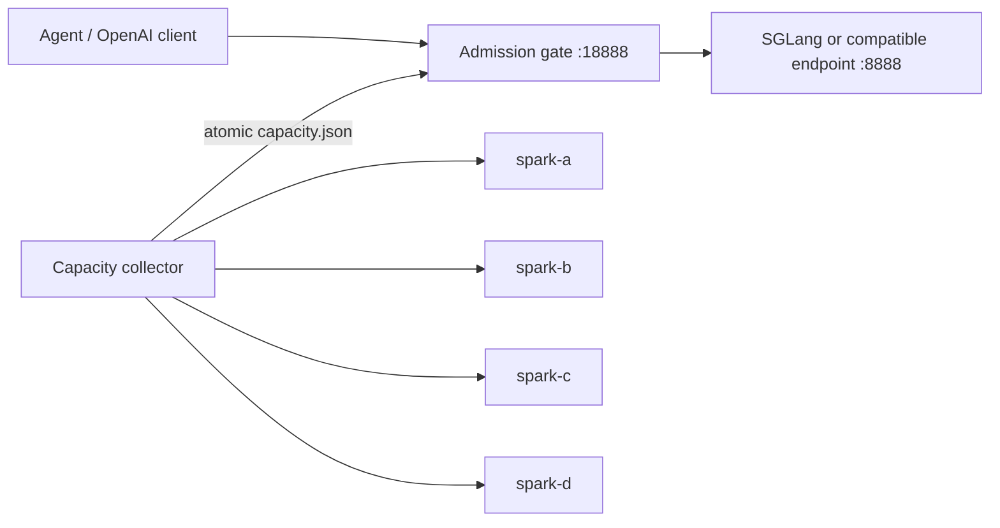

# DGX Spark Admission Gate

A small OpenAI-compatible reverse proxy that protects a four-node DGX Spark
inference cluster from oversized and overlapping requests.

It combines two controls:

- **Estimated-token reservation**: each admitted request reserves a shared
  budget until its upstream response finishes.
- **Live pressure control**: a read-only collector samples Linux memory,
  pressure stall information (PSI), OOM counters, and SGLang-compatible
  `/get_load` data. The gate dynamically exposes 0–4 heavy slots.

This recipe was developed after long-running agent sessions repeatedly failed
during context compression. Retrying the same 100K-token request did not help:
the request either timed out during compression or reached the server too
large. Moving admission ahead of the model call makes overload explicit and
keeps enough headroom for a checkpoint or handoff.

## Architecture



The adaptive controller fails closed when telemetry is stale or malformed. It
drains active work without killing it, then changes admission for new work.

## What is included

- Normal OpenAI-compatible proxy routes:
  `/v1/chat/completions` and `/v1/completions`
- A bounded light route: `/light/v1/chat/completions`
- An opt-in streaming compression route:
  `/aux/compression/v1/chat/completions`
- FIFO queues with alternating normal/compression grants
- At most one active compression request
- Shared estimated-token reservations
- Dynamic 0–4 heavy-request concurrency
- `/healthz` and `/status` endpoints
- Atomic, locked telemetry snapshots

## Install

Python 3.11 or newer is required.

```bash
git clone https://github.com/kajikuni/dgx-spark-admission-gate.git
cd dgx-spark-admission-gate
python3 -m venv .venv
. .venv/bin/activate
pip install -e '.[test]'
pytest
```

Configure `~/.ssh/config` so `spark-a` through `spark-d` resolve to the four
nodes. The collector defaults to those aliases. You can provide explicit SSH
targets instead:

```bash
spark-capacity-collect --once \
  --node spark-a=user@host-a \
  --node spark-b=user@host-b \
  --node spark-c=user@host-c \
  --node spark-d=user@host-d \
  --engine-url http://host-a:8888
```

For nodes reached through a bastion, add `--jump-host user@bastion`. Run the
collector continuously (10-second default interval):

```bash
spark-capacity-collect --engine-url http://host-a:8888
```

Then start the gate:

```bash
spark-request-gate \
  --host 0.0.0.0 \
  --port 18888 \
  --upstream http://host-a:8888 \
  --adaptive
```

Point the OpenAI-compatible client at `http://GATE_HOST:18888/v1`.

Example user services are in [`examples/`](examples). Their paths and hostnames
are placeholders; edit them for your environment. Protect a remotely reachable
gate with firewall rules or an authenticated TLS proxy.

## Default policy

| Control | Default |
|---|---:|
| Shared estimated-token budget | 262,144 |
| Normal request estimate limit | 131,072 |
| Compression request estimate limit | 65,536 |
| Expected normal output reserve | 4,096 |
| Expected compression output reserve | 8,192 |
| Healthy heavy concurrency | 4 |
| Caution memory headroom | below 10 GiB |
| Critical memory headroom | below 6 GiB |
| Telemetry maximum age | 30 seconds |

All token limits are command-line options. Start conservatively and tune from
measured workload behavior:

```bash
spark-request-gate --help
```

The controller reduces admission to one slot under caution pressure. It closes
new admission under critical pressure, after a new OOM kill, or when telemetry
becomes unhealthy. Recent upstream failures and slow eligible response starts
also reduce concurrency and start a cooldown.

## Token estimate and its limits

The gate intentionally does not retain prompt content. Its fast estimator uses:

```text
ceil(ASCII characters / 4 + non-ASCII characters)
+ 1,024 request overhead
+ min(declared output, configured output reserve)
```

This is an admission estimate, not the model tokenizer and not the model's
context-window setting. It is deliberately conservative for mixed Japanese and
English agent traffic. Tokenization differs by model and payload shape, so
calibrate the limits with real requests before treating them as capacity facts.
The upstream engine remains responsible for exact context validation.

The output reserve is capped because clients often declare very large output
limits that they rarely consume. Increase it for workloads that routinely
generate long outputs.

## Compression route

The compression endpoint requires `stream=true` and returns ordinary upstream
SSE plus gate lifecycle events:

- `queued`
- `admitted`
- `failed`

This lets an agent distinguish queue delay from provider execution. The route
has its own queue bound and reservation limit, but shares the same global budget
with normal requests. A client should checkpoint durable state before calling
compression; if compression cannot fit, start a fresh session from that
checkpoint instead of retrying an ever-growing context.

## Operational checks

```bash
curl -s http://127.0.0.1:18888/healthz
curl -s http://127.0.0.1:18888/status | python3 -m json.tool
```

Useful fields include `estimated_token_reserved`, per-kind queue depth,
effective concurrency, pressure reason, memory headroom, and observed KV usage.

## Scope

The collector currently expects exactly four nodes named `spark-a` through
`spark-d` and an SGLang-style `/get_load` response. The reverse proxy itself can
front another OpenAI-compatible server, but adaptive mode needs that telemetry
schema or a compatible provider implementation.

## Switchless four-node fabric

The production setup that motivated this gate uses a switchless four-node DGX
Spark ring. Fabric construction is maintained separately in
[FujitsuPolycom/SparkRing](https://github.com/FujitsuPolycom/sparkring). That
project contains the patched NCCL transport, ring and virtual-mesh host setup,
model profiles, launch tooling, and validation records.

The custom `NCCL_SWITCHLESS_RING_ONLY` and `NCCL_SKIP_TREE_CONNECT` settings
belong to SparkRing's patched NCCL; they are not stock NCCL options. Follow the
exact profile and library version documented there. The admission gate is
transport-independent and only sits in front of the resulting OpenAI-compatible
endpoint.

## 日本語要約

長大会話の圧縮を何度も再試行してリクエストがさらに肥大化する問題に対し、
モデルAPIの手前で推定トークンを予約し、4台のメモリ余力・PSI・OOM・KV使用量を
見て同時投入数を0〜4へ動的に変えるレシピです。推定値は厳密なトークナイザでは
ありません。実運用のプロンプトで計測し、余裕を持たせて調整してください。

## License

MIT
